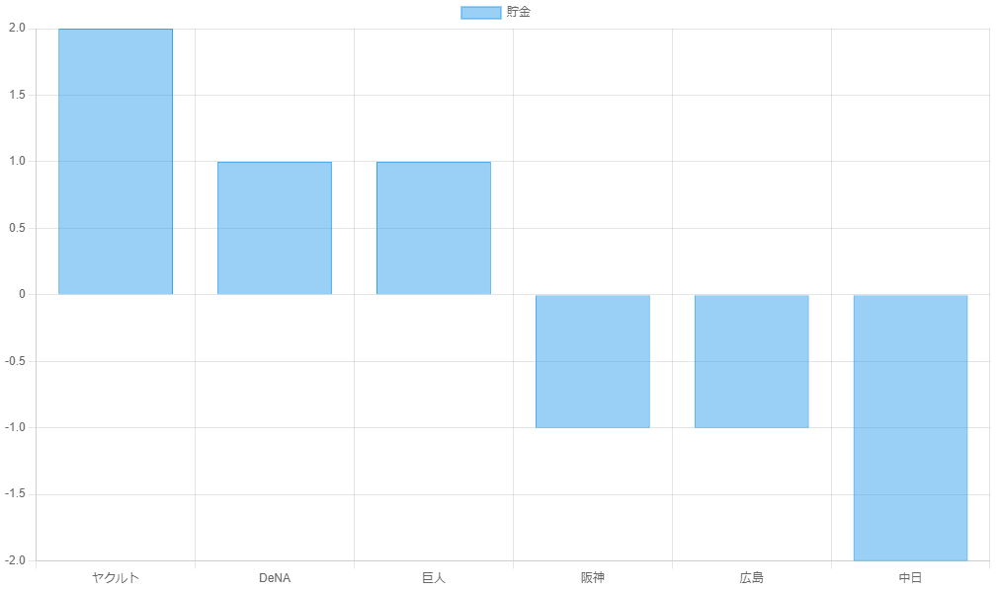

npb-web-scraping
===

プロ野球の記録を JSONファイルに書き出すコードです。

## Usage
```bash
git clone https://github.com/Ant2357/npb-web-scraping.git
cd npb-web-scraping
npm i
npm run build
node ./lib/main.js
```
## Result
```
[
  {
    "rank": 1,
    "name": "ヤクルト",
    "playGameCount": 3,
    "win": 2,
    "lose": 0,
    "draw": 1,
    "pct": 1,
    "gamesBehind": "-",
    "remainingGames": 140,
    "run": 13,
    "ra": 7,
    "hr": 1,
    "sb": 3,
    "avg": 0.29,
    "era": 2.1,
    "pythagenPat": 0.744
  },
  {
    "rank": 2,
    "name": "DeNA",
    "playGameCount": 3,
    "win": 2,
    "lose": 1,
    "draw": 0,
    "pct": 0.667,
    "gamesBehind": "0.5",
    "remainingGames": 140,
    "run": 11,
    "ra": 9,
    "hr": 2,
    "sb": 1,
    "avg": 0.294,
    "era": 2,
    "pythagenPat": 0.586
  },
  .
  .
  .
]
```

## View Savings Graphs
```bash
npx serve
```


## Author
[@ant2357](https://twitter.com/ant2357)