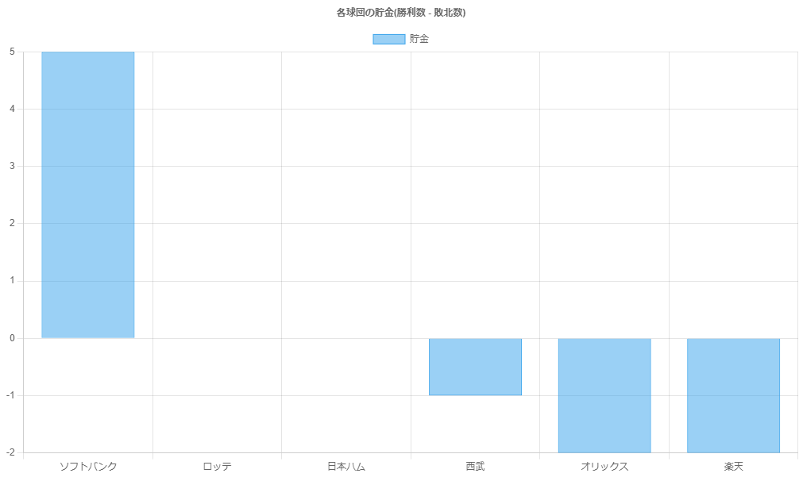
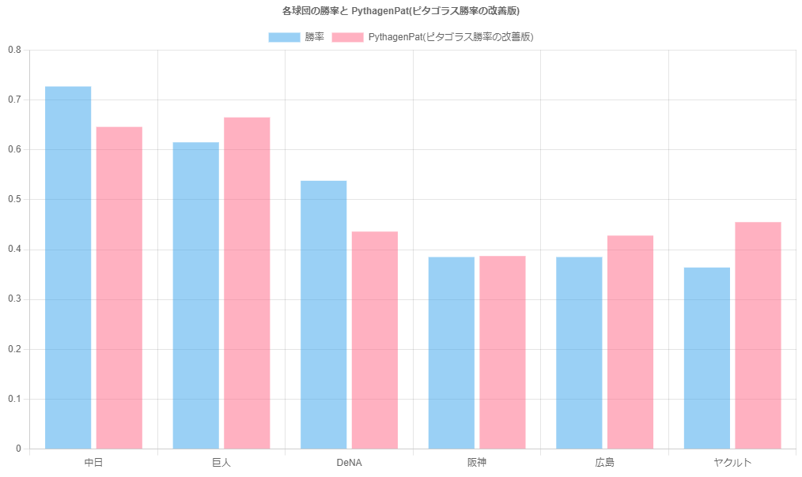

npb-web-scraping
===

プロ野球の記録を JSONファイルに書き出すコードです。

## Usage
```bash
git clone https://github.com/Ant2357/npb-web-scraping.git
cd npb-web-scraping
npm i
npm run build
node ./lib/main.js
```
## Result
```
[
  {
    "rank": 1,
    "name": "中日",
    "playGameCount": 13,
    "win": 8,
    "lose": 3,
    "draw": 2,
    "pct": 0.727,
    "gamesBehind": "-",
    "remainingGames": 130,
    "run": 38,
    "ra": 26,
    "hr": 5,
    "sb": 1,
    "avg": 0.24,
    "era": 1.83,
    "e": 4,
    "pythagenPat": 0.646
  },
  {
    "rank": 2,
    "name": "巨人",
    "playGameCount": 13,
    "win": 8,
    "lose": 5,
    "draw": 0,
    "pct": 0.615,
    "gamesBehind": "1",
    "remainingGames": 130,
    "run": 44,
    "ra": 29,
    "hr": 7,
    "sb": 6,
    "avg": 0.253,
    "era": 1.95,
    "e": 4,
    "pythagenPat": 0.665
  },
  .
  .
  .
]
```

## View Graphs
```bash
npx serve
```

### Savings Graph


### PythagenPat Graph


## Author
[@ant2357](https://twitter.com/ant2357)