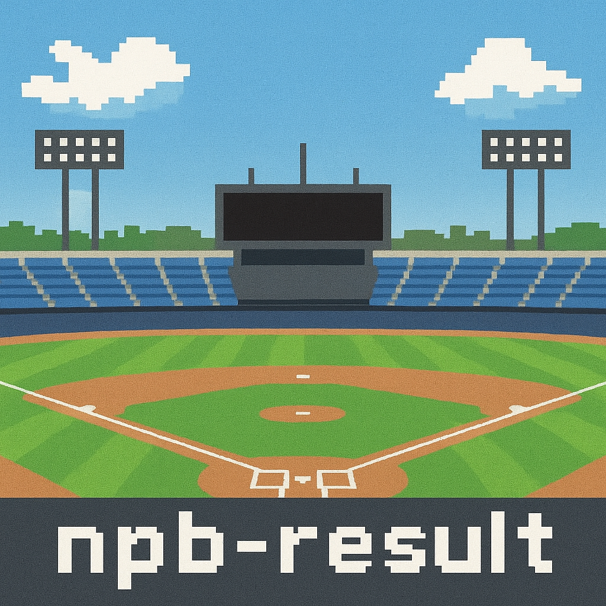

<h2 align="center">
  npb-result(NPB Web API)
</h2>

<div align="center">
  
</div>

<div align="center">
  <p>日本プロ野球の順位表情報を返す Web API です。 </p>
</div>

## Usage

### Central League(セ・リーグ)
`GET https://npb-result.ant-npb.workers.dev/api/cl`

### Pacific League(パ・リーグ)
`GET https://npb-result.ant-npb.workers.dev/api/pl`

### Interleague Game(セ・パ交流戦)
`GET https://npb-result.ant-npb.workers.dev/api/cp`

### Exhibition Game(オープン戦)
`GET https://npb-result.ant-npb.workers.dev/api/op`

## Example

### Request
```sh
GET https://npb-result.ant-npb.workers.dev/api/cl
```
### Response
```json
[
  {
    "id": 1,
    "rank": 1,
    "name": "巨人",
    "playGameCount": 3,
    "win": 3,
    "lose": 0,
    "draw": 0,
    "pct": 1,
    "gamesBehind": "-",
    "remainingGames": 140,
    "run": 21,
    "ra": 5,
    "hr": 3,
    "sb": 1,
    "avg": 0.342,
    "era": 0.96,
    "e": 1,
    "pythagenPat": 0.935
  },
  {
    "id": 2,
    "rank": 2,
    "name": "阪神",
    "playGameCount": 3,
    "win": 2,
    "lose": 1,
    "draw": 0,
    "pct": 0.667,
    "gamesBehind": "1",
    "remainingGames": 140,
    "run": 7,
    "ra": 4,
    "hr": 2,
    "sb": 0,
    "avg": 0.202,
    "era": 1.38,
    "e": 1,
    "pythagenPat": 0.693
  },
  {
    "id": 3,
    "rank": 2,
    "name": "DeNA",
    "playGameCount": 3,
    "win": 2,
    "lose": 1,
    "draw": 0,
    "pct": 0.667,
    "gamesBehind": "0",
    "remainingGames": 140,
    "run": 7,
    "ra": 2,
    "hr": 2,
    "sb": 1,
    "avg": 0.186,
    "era": 0.67,
    "e": 1,
    "pythagenPat": 0.848
  },
  {
    "id": 4,
    "rank": 4,
    "name": "広島",
    "playGameCount": 3,
    "win": 1,
    "lose": 2,
    "draw": 0,
    "pct": 0.333,
    "gamesBehind": "1",
    "remainingGames": 140,
    "run": 4,
    "ra": 7,
    "hr": 0,
    "sb": 0,
    "avg": 0.258,
    "era": 2.33,
    "e": 0,
    "pythagenPat": 0.307
  },
  {
    "id": 5,
    "rank": 4,
    "name": "中日",
    "playGameCount": 3,
    "win": 1,
    "lose": 2,
    "draw": 0,
    "pct": 0.333,
    "gamesBehind": "0",
    "remainingGames": 140,
    "run": 2,
    "ra": 7,
    "hr": 0,
    "sb": 1,
    "avg": 0.2,
    "era": 2.52,
    "e": 2,
    "pythagenPat": 0.152
  },
  {
    "id": 6,
    "rank": 6,
    "name": "ヤクルト",
    "playGameCount": 3,
    "win": 0,
    "lose": 3,
    "draw": 0,
    "pct": 0,
    "gamesBehind": "1",
    "remainingGames": 140,
    "run": 5,
    "ra": 21,
    "hr": 1,
    "sb": 0,
    "avg": 0.182,
    "era": 6.31,
    "e": 1,
    "pythagenPat": 0.065
  }
]
```

> [!WARNING]
> オープン戦では remainingGames(残試合) を返しません

## Author
[@ant2357](https://twitter.com/ant2357)

## License
[MIT license](https://en.wikipedia.org/wiki/MIT_License)
